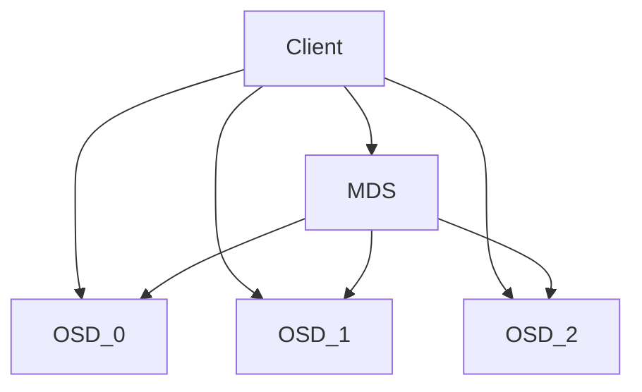

# pfutils

Basically, concurrency is not important when using Direct-attached storage(DAS). Reading blocks is a major bottleneck for DAS because metadata is very small and can be read immediately.

But what about network-attached storage (NAS)? To read metadata from a file system that satisfies concurrency, communication with the metadata server(MDS) is required. The MDS may need to be read by communicating with another NAS. In that case, a round trip time of several milliseconds may occur. This is part of an unnecessary bottleneck, as it introduces another overhead that DAS does not have.

Basic file handling commands such as cp and rm in linux do not meet this requirement because they are made to target the traditional DAS. This application is designed to meet these needs.

# Usage

## Installation

Depending on how python is installed, the command may be slightly different. You can usually install it with one of the commands below.

```
# If python3-pip is named "pip3"
$ pip3 install pfutils
# If pip is unnamed but there is pip module in "python3"
$ python3 -m pip install pfutils
# If it is named without "3", remove "3" as appropriate...
```

Following the flow of the Python package installer, the pftuils command can be used as follows:

```
# If you have sudo privileges, the command will be installed in /usr/local/bin and
# so on, and you can run it right away.
$ pfutils --help

# If you don't have sudo privileges, the commands will be installed in ~/.local/bin 
# and you need to add this path to $PATH so that it can be executed without path.

# Regardless of the environment variable, if python3 is in the path, it can be 
# executed as follows.
$ python3 -m pfutils --help
```

## Commands

```
Usage: pfutils cp [OPTIONS] SRC DST

  copy files and directories

Options:
  -j, --num-workers INTEGER  number of concurrent workers
  -c, --chunksize INTEGER    size of chunk
  -r, --recursive            copy directories recursively
  --help                     Show this message and exit.

Usage: pfutils rm [OPTIONS] [FILE]...

  remove files or directories

Options:
  -j, --num-workers INTEGER  number of concurrent workers
  -r, --recursive            remove directories and their contents recursively
  -c, --chunksize INTEGER    size of chunk
  --help                     Show this message and exit.
```

# Implementation focus

Under Python's GIL constraints, using threads is known to improve IO performance, but when concurrency is actually granted using ThreadPoolExecutor, you can see that this is not really the case. So I used ProcessPoolExecutor in my implementation of Python.
 
In case of using the map method, since the block operation starts after reading all the metadata, operation loss occurs during that time. However, when the submit method is used, the performance is greatly degraded because chunks are not divided. (It is the same as when giving chunksize=1 in the map.) Therefore, I modified the ProcessPoolExecutor so that it can be executed in chunks to give concurrency to the task.

I can give concurrency to reading metadata as well, but there doesn't seem to be a need for that operation to improve performance. However, its implementation may change in the future to work with more metadata.

When implemented as a thread in C++ and bound to Python, there was a performance improvement under a small cpu resource due to the difference in overhead between process and thread. However, my C++ implementation is not smooth, so I plan to implement the same behavior in C++ after completing the python implementation.

# Performance Benchmark under cephfs

## Cluster configuration



OSD is used to write blocks in cephfs and MDS is used to perform file system related operations. MDS also writes data into the OSD to safely manage the metadata it uses. I connected Client, OSD, and MDS through L2 switch of 10Gbps, and 3 OSD nodes were configured using ramdisk to sufficiently satisfy 10Gbps switch. No replication is configured.

## Experiment

Writing a large amount to a single file does not reveal the metadata overhead, which is a problem when using a network-based file system when only block IO is used. I will use as an example the copy and delete of imagenet, which may appear in general. In the experiment, I dropped the page cache before executing the instruction.

## cp

### DAS to DAS (different filesystems)

```
$ time cp  /host/imagenet-2012 /mnt/nvme/imagenet-2012 -r
real    7m50.016s
user    0m2.656s
sys     3m3.991s

# approximately 317.3 MiB/s
```

### DAS to DAS (same filesystem)

```
$ time cp /mnt/nvme/imagenet-2012/ /mnt/nvme/imagenet-2012-copy -r

real    6m29.872s
user    0m2.746s
sys     2m47.706s

# approximately 382.5 MiB/s
```

### DAS to NAS

```
$ time cp /mnt/nvme/imagenet-2012/ /mnt/cephfs/imagenet-2012 -r

real    9m47.546s
user    0m2.619s
sys     2m19.726s

# approximately 253.8 MiB/s
```

### NAS to NAS (same filesystem)

```
$ time cp /mnt/cephfs/imagenet-2012 /mnt/cephfs/imagenet-2012-copy -r

real    17m20.175s
user    0m3.249s
sys     2m6.009s

# Haha.. I couldn't finish it to the end due to the RAM limit of my computers
# (I guess about 30 GiB of uncopied data is left) But you can see it's very
# slow. Since writes are written to the page cache and writebacks but not 
# reads, sequentially reading from the NAS has a large overhead.
```

### NAS to DAS

```
$ time cp /mnt/cephfs/imagenet-2012/ /mnt/nvme/imagenet-2012-copy -r

real    12m52.895s
user    0m3.024s
sys     2m58.706s

# approximately 192.9 MiB/s
```

## pfutils cp -j20 -c20000 -r

### DAS to NAS

```
$ time pfutils cp -r -j20 -c20000 /mnt/nvme/imagenet-2012 /mnt/cephfs/imagenet-2012/
100%|████████████████████████████| 1331167/1331167 [01:24<00:00, 15689.53it/s]

real    2m22.602s
user    2m20.497s
sys     5m11.242s

# approximately 1046 MiB/s
```

### NAS to NAS (same filesystem)

```
$ time pfutils cp -r -j20 -c20000 /mnt/cephfs/imagenet-2012/ /mnt/cephfs/imagenet-2012-copy/
68%|██████████████████████       | 900000/1331167 [06:27<03:05, 2323.62it/s]
real    7m23.195s
user    2m27.837s
sys     4m37.514s

# It stops at the same point as normal cp, but a simple comparison will be possible.
```

### NAS to DAS

```
$ time pfutils cp -r -j20 -c20000 /mnt/cephfs/imagenet-2012/ /mnt/nvme/imagenet-2012-copy/
100%||████████████████████████████| 1331167/1331167 [08:32<00:00, 2596.60it/s]

real    9m18.036s
user    2m28.436s
sys     4m43.750s

# approximately 267 MiB/s
```

## rm

### DAS

```
$ time rm /mnt/nvme/imagenet-2012-copy/ -r

real    0m48.581s
user    0m0.439s
sys     0m13.494s
```

### NAS

```
$ time rm /mnt/cephfs/imagenet-2012/ -r

real    4m9.142s
user    0m0.689s
sys     0m10.066s
```

## pfutils rm -j20 -c20000 -r

### NAS

```
$ time pfutils rm -j20 -c20000 -r -y /mnt/cephfs/imagenet-2012/
file: 100%|██████████████████████| 1331167/1331167 [00:16<00:00, 78883.35it/s]
directory: 100%|█████████████████████████| 2003/2003 [00:03<00:00, 641.30it/s]

real    1m37.219s
user    0m31.170s
sys     0m21.037s
```
